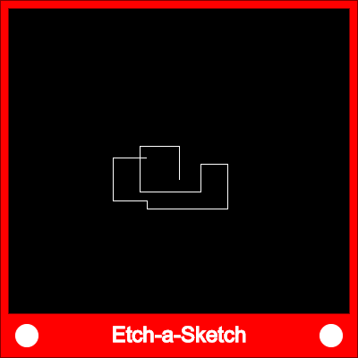

   
Build an Etch-A-Sketch
============
In this assignment you will create a simulation of the Etch-A-Sketch toy
Suggested steps to complete this assignment
-------------------------------
1. Start a new program. Save your program with a meaningful name.
2. In `setup()` draw one rectangle that fills the screen and then a slightly smaller differently colored rectangle inside of it. Delete the `background()` in `draw()` and run your program. 
3. Declare and initialize two global variables `x`, `y` and and initialize them to the center of the screen.
4. In `draw()` draw a small white circle at (x,y). 
5. Add some `if` statements:
+ If key means "up", decrease y
+ If key means "down", increase y
+ If key means "left", decrease x
+ If key means "right", increase x
5. You can decorate your Etch-A-Sketch with the `text()` function

